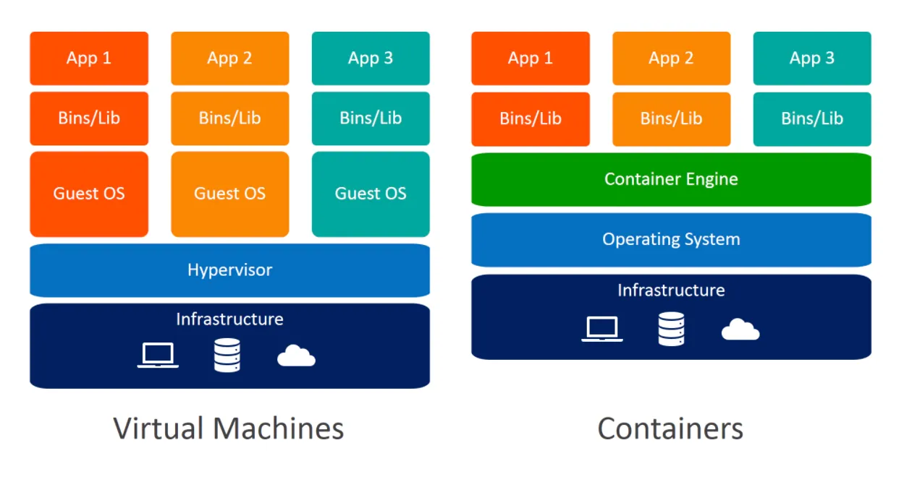
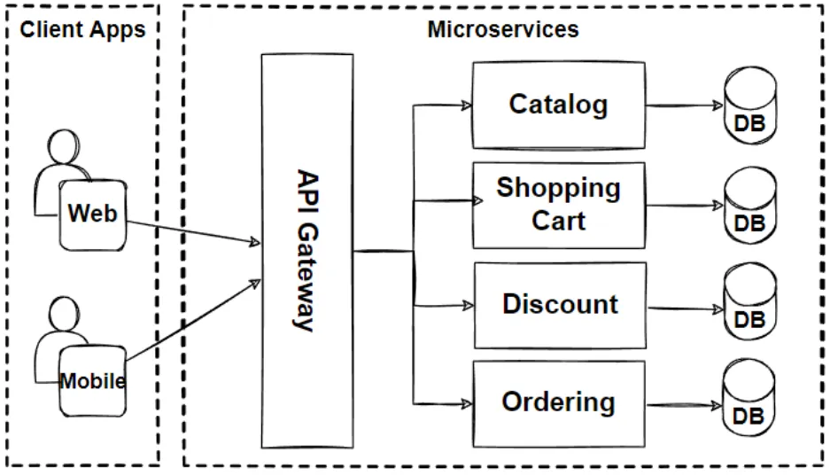

# __Kubernetes Fundamentals__ 
> 46% of the KCKA (Kubernetes and Cloud Native Associate) exam

## __Kubernetes Resources__
A resource refers to a computing element provided by the cluster that can be requested, allocated and managed. Resources are declarative as K8's abstracts away from the underlying infrastructure 

### __Common types of resources__ 

1. __Pods__: Smallest deployable unit in Kubernetes, Represents a single instance of a running proccess in a cluster 
2. __Services__: An abstraction that defines a logical set of pods and a ploicu by which to access them. Enables communication between different sets of pods 
3. __ReplicaSets__: Ensures that a specified number of replicas (pod instances) are running at all times. It helps with scaling and high availabilty.
4. __Deployments__: Provides declarative updates to applications. A deployment allows you to describe an applications life cycle, like which images to use for the app, the number of pod replicas, and the way to update them. 
5. __ConfigMaps and Secrets__: Resources for decoupling configuration artificats from pod specifications. ConfigMaps hold configuration data, Secrets hold sensitive information such as password or API keys.
6. __Persistent volumes (PVs) and Persistent Volume Claims (PVCs)__: PVs represent physical storage resources in the cluster, while PVCs are requests for those resources by pods. They provide a way to manage and abstract storage. 
7. __Namespaces__: A way to divide cluster resources between multiple users (via resource quota), teams, or applications. It provides a scope for names, allowing the same names to be used in different namespaces.
8. __ServicesAccount__: Defines a set of permissions and access control for pods. 

Resources are usually defined using YAML or JSON configuration files and submitted to the Kubernetes API server, the control plane then ensures that the desired state specified in the these configuration file is maintained.

Resources are managed and manipulated throught the Kubernetes API, The Kubernetes API is a set of HTTP endpoints that allow you to interact with Kubernetes control plane to create, modify and retrieve information about resources in the cluster.

__Resource__: A deployable entity in K8's (pods,services, deployments, ...) which represents a unit of work or a specific functionality. 

__Kubernetes API__: The interface through which you interact with the Kubernetes control plane to manage and control resources in the cluster. 

### __Kubernetes verb__ 
> These verbs support single resources only 

```
get 
create 
update
patch
delete
proxy

```
## __Kubernetes Architecture__ 
> Kubernetes has a distrubuted architecture that consists of a set of interconnected components, each with a specific responsibilities
### __Key components__ 
1. __Master Node__:
    - __Kubernetes API Server (kube-apiserver)__: Exposes the Kubernetes API and is the entry point for all administrative tasks. It is responsible for validating and processing API requests.
    - __etcd__: A distributed key-balue store that stores the configuration data of the cluster. The entire state of the cluster is stored in etcd.
    - __Kubernetes Controller Manager__: Monitors the state of the cluster through the API server and works to bring the actual state of the cluster closer to the desired state which is specified in the YAML or JSON file when creation of resources. 
    - __Kubernetes Scheduler__: Assigns nodes to newly created pods based on resource requirements, hardware specifications and other constraints. 
2. __Node (Minion/ Worker) Node__:
    - __Kubelet__: Ensures that containers are running in a pod. It communicates with the master node to recieve instructions and report the status of the node.
    - __Kube Proxy__: Maintains network rules on nodes. It enables communication between pods on different nodes and from external networks to pods. 
    - __Container Runtime__: The software responsible for running containers, such as Socker or containerd. 
3. __Pods__:
    - The smallest deployable units in Kubernetes. A pod can contin one or more containers that share the same network namespace, storage and have a unique IP address. 
4. __Services__:
    - An abstraction that defines a set of pods and a policy for accessing them. Services provide stable endpoints for pods, even as they are scaled up or down. 
5. __Controller__: 
    - Manages the deployment, scaling and updating of pods. Examples include ReplicaSets, Deployments, StatefulSets, etc.
6. __ConfigMap and Secrets__: 
    -   Resources for managing configuration data and secrets separetly from pod specifications. 
7. __Persistent Volumes (PVs) and Persistent Volume Claims (PVCs)__:
    - Allow the decoupling of storage from pods, providing a way to maange and abstract storage resources. 
8. __Namespaces__:
    - A way to divide cluster resources between multiple users, teams or applications.

### __Flow of how Kubernetes works__

1. A user or system sends a request to the Kubernetes API server.
2. The API server validates and processes the request.
3. The desired state is stored in etcd.
4. The Kubernetes controllers work to bring the actual state of the cluster in line with the desired state.
5. The Kubelet on each node ensures that the containers in the pods are running. 
6. The Kube Proxy faciliates networking between pods and external services. 


## __Kubernetes API__
> Serves as the central communication hub for interacting with the Kubernetes control plane. It allows users, administrators and external systems to manage and control Kubernetes resources.

1. __RESTful Interface__: 
    - The Kubernetes API is designed as a RESTful API, it follows the principles of Representational State Transfer. This make it accessible over standard HTTP methods (GET, POST, PUT , DELETE) and is designed to be stateless. 
2. __Resource Endpoints__: 
    - Each Kubernetes resource (e.g. pods, services, deployments) is represented as an endpoint in the API. For example, the endpoints for managing pods is `/api/v1/pods`
3. __Versioning__: 
    - The API is versioned to ensure compatability and provide a stable interface. The API version is included in the URL, such as `/api/v1` or `/apis/apps/vi`
4. __Declarative Configuration__:
    - Users interact with the API by submitting declarative configuration files (usually in YAML or JSON) that describes the desired state of the system. For example, a user might create a Deployment resource to specify how many replicas a pod should be running. 
5. __Authentication and Authorization__: 
    - The API server enforces authentication and authorization. Users or systems interacting with the API need valid credentials to perform actions and RBAC (Role-Based Access Control) policies defined what actions are allowed.
6. __API Groups__:
    - Resources in Kubernetes are organized into API groups. For example, core resources like pods and services are in the `v1` group while resources related to apps are in the `apps` group. This allows for better organisation as the number of resources grows.
7. __Watch API__:
    - The API supports a watch mechanism, allowing clients to recieve real-time updates about changes to resources. This is useful for applications that need to react to changes in the cluster.
8. __Swagger/OpenAPI Specifications__:
    - The Kubernetes API is documented using the OpenAPI Specification (formerly known as Swagger). This documentation provides a detailed reference for all API endpoints, their parameters and expected responses.

### __High level example of interacting with the API__ 

```
# Get information about all pods in the default namespace
kubectl get pods

# Create a new pod based on a YAML configuration file
kubectl apply -f pod-definition.yaml

# Scale the number of replicas in a deployment
kubectl scale deployment/my-deployment --replicas=3

```

In the above example, `kubectl` is making HTTP requests to the Kubernetes API server on behalf of the user and the API server processes these requests to manage the cluster's state. 

## __Containers__ 
> Containers are lightweight and poratble unit that encapsulates software and dependencies, allowing it to run consistenly across various envorinments, containers provide a way to package, distribute and run applications in a predictable and isolated manner. 

### __Key Concepts__

1. __Container Image__: 
    - At the core of containers is the container image, which is a lightweight, standalone and executable software package that includes everthing needed to run a peice of software, including the code, runtime, libraries and system tools. Images are often layered and each layer represents a set of changes to the file system. 
2. __Docker and Container Runtimes__:
    - Docker is a popular containerization platform that introduced the concept of container images and a runtime environment for running containers. While Docker is widely used, there are other container runtimes like containerd and rkt. 
3. __Containerization Technology__: 
    - Containers use operating system-level virtualization to procide isolated environments for running applications. Unlike traditional virtualization, where each virtual machine runs a full operating system, containers share the host OS kernel but have their own isolated user space. This makes containers more lightweight and efficient. 
    
  

4. __Dockerfile__:
    - To create a container image, developers often use a Dockerfile, which is a text file that contains instructions for building the image. The Dockerfile specifies the base image, sets up the environment, copies application code and defined runtime configuration. 
5. __Container Orchestration__: 
    - While containers offer a consistent and isolated runtime environment, orchestrating and managing large-scale container deployments can be complex. Container orchestration platforms, such as Kubernetes, Docker Swarm and Apache Mesos, provide tools for deploying, scaling and managing containerized applications. 
6. __Isolation__:
    - Containers use namespaces and cgroups (control groups) to provide process and resource isolation, Each container has its own filesystem, network and process space, making it isolated from other containers running on the same host.
7. __Portability__:
    - Containers are designed to be portable across different environments, whether its a developer's laptop, a test environment or a production cluster. This portability is achieved by packaging the application and its dependencies into a container image. 
8. __Microservices Architecture__: 
    - Containers are often associated with microservices architecture, where and application is divided into small, independent servcies that communcate through well-defined APIs. Containers make it easier to deploy and scale individual microservices independently. 
    
9. __DevOps and Continues Deployments__:    
    - Containers play a crucial role in modern DevOps practices, enabling continous integration and continuous deployment (CI/CD). They faciliate the creation of consistent environments for testing, staging and production, reduing the "it works on my machine" problem (errors been environment specific and hard to replicate)

#### __How Docker works__

Docker Engine is the core component of the Docker platform responsible for building, running, and managing Docker containers. It consists of several key parts, and here's an overview of how Docker Engine works:

1. __Docker Daemon__:
    - The Docker Daemon (dockerd) is a background process that runs on the host machine. It is responsible for managing Docker containers. The daemon listens for Docker API requests and manages Docker objects such as images, containers, volumes, and networks.
2. __Docker Client__:
    - The Docker Client (docker) is a command-line tool or API client that allows users to interact with the Docker Daemon. Users can issue commands to the Docker Daemon using the Docker Client, and the client then communicates with the daemon over the Docker API.
3. __Docker Images__:
    - Docker images are read-only templates that contain everything needed to run a container, including the application code, runtime, libraries, and system tools. Images are built from a set of instructions specified in a Dockerfile, which is a text file that defines the image's configuration.
4. __Docker Registry__:
    - Docker images can be stored and shared through a Docker Registry, which is a repository for Docker images. Docker Hub is a public registry that many users leverage, but organizations often set up private registries for security and performance reasons.
5. __Docker Container__:
    - A Docker container is a runnable instance of a Docker image. Containers are isolated from each other and from the host system, using namespaces and cgroups to provide process and resource isolation.
6. __Dockerfile__:
    - Developers define the configuration of a Docker image using a Dockerfile. The Dockerfile includes instructions for building the image, such as the base image, environment variables, commands to run, and other settings.
7. __Layered File System__:
    - Docker images use a layered file system, which allows for efficient image sharing and reduces duplication. Each instruction in a Dockerfile creates a new layer in the image. Layers are cached, making the build process faster, and shared among images based on the same base image.
8. __Networking__:
    - Docker provides a networking model that allows containers to communicate with each other and with the external world. Each container gets its own network namespace, and Docker creates a bridge network by default for containers to connect to.
9. __Volumes__:
    - Docker Volumes provide a way to persist data generated by and used by Docker containers. Volumes are separate from the container file system and can be shared among containers.

##### __Breakdown of how Docker works__

1. A user defines a Docker image using a Dockerfile.
The Docker Daemon builds the image by executing the instructions in the Dockerfile.
2. The built image is stored in the host's local image cache or pushed to a Docker Registry.
Users can create containers from the built image using the Docker Client.
3. The Docker Daemon manages the execution and lifecycle of containers.
4. Containers can communicate with each other and with external systems using Docker's networking capabilities 

## Scheduling 
In Kubernetes, scheduling refers to the process of assigning workloads, such as containers, to nodes in the cluster. The scheduler is a key component of the Kubernetes control plane, responsible for making descisions about where to place the conatiners based on various factors and contstraints. To ensure effiecient resource utlization, fault tolderance and high availabilty.

1. __Pod Definition__:
    - A user creates a Pod definition, which includes specifications for containers, resource requirements, and other attributes.
    - Pods are the smallest deployable units in Kubernetes and can contain one or more containers.
2. __Scheduling Decision__:
    - When a Pod is created, it does not have a designated node to run on.
    - The Kubernetes scheduler examines the Pod's resource requirements, affinity/anti-affinity rules, node constraints, and other policies to make a scheduling decision.
3. __Node Selection__:
    - The scheduler selects an appropriate node based on available resources and constraints.
    - Factors considered include CPU and memory requirements, node capacity, and any node affinity/anti-affinity rules specified in the Pod configuration.
4. __Scheduler Extensibility__:
    - Kubernetes allows users to customize the scheduling process by implementing custom schedulers.
    - Custom schedulers can be created to handle specific requirements, policies, or priorities based on the needs of the application or organization.
5. __Node Affinity and Anti-Affinity__:
    - Node affinity and anti-affinity rules help influence the scheduler's decision by specifying preferences or restrictions for Pod placement on nodes.
    - For example, a Pod may have an affinity rule to be scheduled only on nodes with specific labels or anti-affinity rules to avoid co-locating Pods on the same node.
6. __Resource Requests and Limits__:
    - Pods can specify resource requests and limits for CPU and memory.
    - The scheduler uses this information to make decisions on node placement, ensuring that the resource requirements are met and preventing resource contention.
7. __Pod Preemption__:
    - Kubernetes supports pod preemption, which means lower-priority Pods may be evicted from a node to make room for higher-priority Pods if resources become scarce.
8. __Taints and Tolerations__:
    - Nodes can be tainted to repel certain Pods unless the Pods have specific tolerations.
    - This can be useful for reserving nodes for specific workloads or ensuring that certain Pods don't co-locate.
9. __DaemonSets and Node Selectors__:
    - DaemonSets ensure that a copy of a Pod runs on all (or some) nodes in the cluster.
    - Node selectors help specify constraints on nodes that DaemonSets should consider.

Effectivly managing scheduling decesions allows Kubernetes to optimize resource utilization, ensure high availabilty and prodivdes flexibility dor deploting diverse workloads in a cluster. Its Dynamic and continually asjusts to changes in the clusters state, such as failures, new nodes or changes in specifications.

### __Key factors and Contraints that effects scheduler descion making__ 

1. __Resource Requirements__:
    - The scheduler considers the resource requirements of Pods, such as CPU and memory. It aims to place Pods on nodes that have sufficient available resources to meet the Pod's requests and limits.
2. __Node Capacity__:
    - The overall capacity of nodes is taken into account. The scheduler looks at the total available resources on each node to ensure that placing a Pod on a particular node won't lead to resource exhaustion.
3. __Affinity and Anti-Affinity Rules__:
    - Affinity rules express preferences for Pod placement based on node labels. For example, a Pod can be configured to prefer nodes with a specific label.
    - Anti-affinity rules express preferences to avoid placing Pods on nodes with certain characteristics. This can be used to distribute workloads or enhance fault tolerance.
4. __Node Selector__:
    - Node selectors are used to constrain Pod placement based on node labels. A Pod can specify a node selector to ensure it is scheduled on nodes with specific labels that match its requirements.
5. __Taints and Tolerations__:
    - Taints are applied to nodes to repel Pods unless the Pods have specific tolerations. This is useful for reserving nodes for specific workloads or scenarios.
    - Tolerations are set on Pods to indicate they are willing to tolerate the taints on certain nodes.
6. __Pod Priority and Preemption__:
    - Pods can have priority classes assigned, and the scheduler uses these priorities to make decisions during resource contention.
    - Pod preemption allows higher-priority Pods to evict lower-priority Pods when resources become scarce.
7. __Node Conditions and Health__:
    - The scheduler considers the health and conditions of nodes. It avoids placing Pods on nodes that are marked as unhealthy or in a degraded state.
8. __Topology Constraints__:
    - Topology constraints consider the physical or logical topology of the cluster. For example, a Pod may specify that it should run on nodes within a specific region, availability zone, or rack.
9. __Resource Bin Packing__:
    - The scheduler aims to efficiently pack Pods onto nodes to maximize resource utilization. It may try to fill nodes to their capacity to minimize wasted resources.
10. __Pod Interactions__:
    - The scheduler considers the interactions between Pods, avoiding co-locating Pods that may negatively impact each other due to network communication or other dependencies.